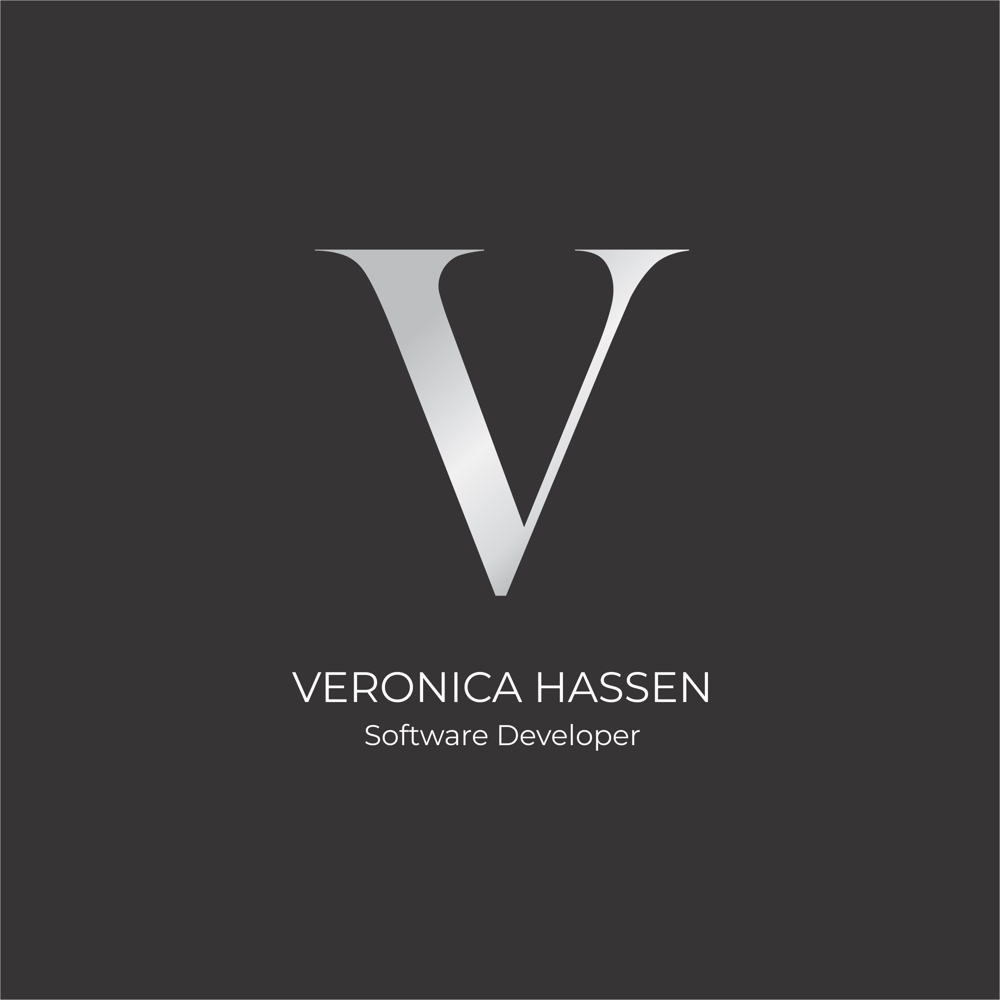

# Mi Portafolio Personal

Este proyecto es un portafolio personal desarrollado con HTML5 y CSS3 como parte de un ejercicio práctico para mostrar mis habilidades y proyectos.

## Características

- Diseño responsivo que se adapta a diferentes tamaños de pantalla (desktop, tablet y móvil)
- Uso de etiquetas semánticas de HTML5
- Estilos personalizados con CSS externo
- Navegación con lista
- Sección de servicios con iconos
- Tabla de tecnologías con columnas de igual ancho
- Proyectos con overlay y efectos visuales
- Formulario de contacto
- Efectos visuales con z-index y opacidad

## Estructura del Proyecto

- `index.html`: Archivo principal con la estructura HTML del portafolio
- `styles.css`: Archivo CSS con todos los estilos del sitio
- `images/`: Carpeta para almacenar las imágenes utilizadas en el portafolio
- `README.md`: Documentación del proyecto

## Requisitos Cumplidos

### HTML
- Uso de etiquetas semánticas: `<header>`, `<nav>`, `<main>`, `<section>`, `<article>`, `<footer>`
- Navegación con lista `<ul>` y `<li>`
- Tabla para mostrar tecnologías
- Formulario de contacto con campos para nombre, apellido, email, teléfono y botón de envío
- Elementos en bloque y en línea correctamente implementados

### CSS
- Uso de unidades relativas (%, rem, vh, vw)
- Flexbox para layout y posicionamiento
- Manejo de box model (margin, padding, border)
- Centrado de elementos con text-align y flex
- Fuente personalizada de Google Fonts (Montserrat)
- Iconos de Font Awesome
- Pseudoclases para enlaces (link, visited, hover, active)
- Estilado personalizado de tablas con nth-child para filas pares e impares
- Uso de z-index para overlays en proyectos
- Uso de opacidad para efectos visuales
- Combinadores CSS (descendiente y directo)
- Media queries para 4 tamaños de pantalla (1080px, 768px, 480px, 375px)

## Mejoras Implementadas

- Texto justificado en la sección "About me"
- Tabla de tecnologías con columnas de igual ancho
- Efectos de hover en elementos interactivos
- Diseño elegante con tonos plateados y negros
- Estructura de código organizada con comentarios
- Variables CSS para facilitar cambios de color y estilo

## Instrucciones para Visualizar

1. Descarga o clona este repositorio
2. Abre el archivo `index.html` en tu navegador web preferido
3. ¡Explora mi portafolio!

## Herramientas Utilizadas

- HTML5
- CSS3
- Google Fonts
- Font Awesome
- Compresión de imágenes para optimizar el rendimiento

---

Desarrollado por Verónica Hassen - 2025
Realizado para la materia de desarrollo Front End